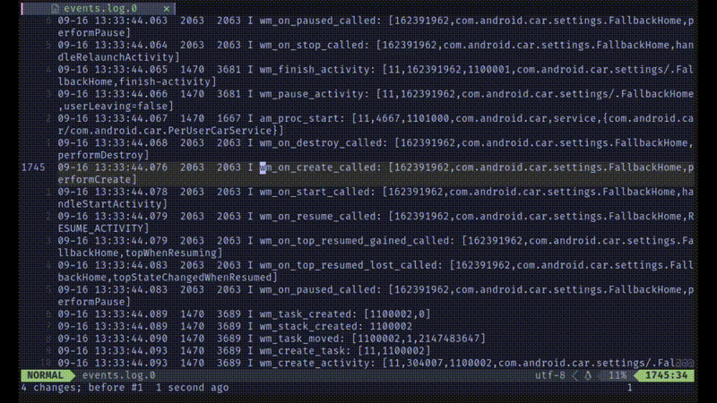

# keyword_search.nvim

A Neovim plugin very easy to search content
Espectial in log analyse



## Install

Using vim-plug:
```
Plug 'JefferyBoy/keyword_search.nvim'
```
Using lazy.nvim
```
use {'JefferyBoy/keyword_search.nvim'}
```

## Commands

- `SearcheInWord` - Add search keyword on current cursor.
- `UnSearcheInWord` - Remote search keyword on current cursor.
- `SearcheCurrentBufferToNew` - Filter search result to a new buffer.(only search current buffer)
- `SearcheAllFilesToNew` - Filter search result to a new buffer.(search all file in current workspace directory)

Recommand to set keymaps to search commands

```lua
local map = vim.keymap.set
map("n", "ss", "<cmd>SearcheInWord false<CR>", ops)   -- keyword to search
map("n", "sa", "<cmd>SearcheInWord true<CR>", ops)    -- append keyword to search
map("n", "sd", "<cmd>UnSearcheInWord<CR>", ops)       -- remove keyword
map("n", "sn", "<cmd>SearcheCurrentBufferToNew<CR>", ops) -- search current buffer result to new buffer
map("n", "sN", "<cmd>SearcheAllFilesToNew<CR>", ops)      -- search all files results to new buffer
```
